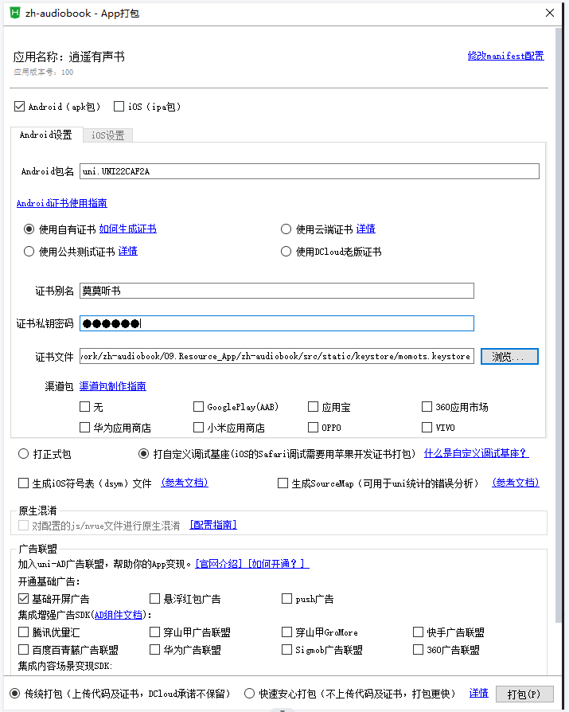

## 技术栈
  - [uniapp](https://uniapp.dcloud.net.cn/api/)--项目框架
  - [Vue2.0](https://cn.vitejs.dev/)--vue语法版本
  - [Vuex](https://v3.vuex.vuejs.org/zh/)--状态管理
  - [TypeScript](https://www.tslang.cn/docs/handbook/basic-types.html)--js语法加强(数据类型约束)
  - [uView2.0](https://www.uviewui.com/components/intro.html)--ui组件库
  - [XZH-musicNotification](https://ext.dcloud.net.cn/plugin?id=3476)--APP原生插件(系统通知栏)

## 项目运行
1. 安装依赖
```
npm install
```

2. 重启编辑器, 不然编辑器可能有此类报错(Cannot find module 'vue' or its corresponding type declarations)

3. 项目启动
```
npm run dev:h5
```
4. 项目build
```
npm run build
```

###### 小声bb
 - 项目虽然用到了TS, 但都是any类型一把梭哈的。个人想法是项目初期自己的TS知识有限，就不瞎折腾了，后面会把这个项目当成一道大型TS练习题来做。目前TS方面自我感觉有点膨胀，闲暇时会慢慢对整个项目进行该有的类型约束

## 移动端调试
#### 调试工具
- HBuilder + MuMu手机模拟器
#### 说明
- 由于此项目用到了[XZH-musicNotification](https://ext.dcloud.net.cn/plugin?id=3476)原生插件，故在进行手机仿真时需要先制作【自定义调试基座】
#### 操作步骤
  - 
  - 
  - 
  - 
  - 
  - 

## 注意点
#### 一. 插件版本(项目如果出现意义不明的报错，不妨应用以下的版本配置)
  * "vue": "^2.6.11",
  * "sass": "^1.51.0" 
  * "sass-loader": "^10.2.1"
  **注意：没有node-sass**

#### 二. 为什么我不选用vue create -p dcloudio/uni-preset-vue my-project后的typescript模板
  * 此方式创建的项目对vue-lic的版本要求是4.5.15及以下，对应的是vue2(4.5.15以上的对应的是vue3)
  * 后续的各种报错...

#### 三. 因为项目是使用vue-cli创建的，所以打包App的时候可能会出现弹窗提示："当前项目的cli版本和云打包服务器的cli版本不一致，有可能出现兼容性问题请升级项目的cli版本后重新打包或继续打包"
  * 
  * [DCloud 社区给的解决方法](https://ask.dcloud.net.cn/article/35627)
  * 我一般是直接批量修改 package.json 中 uni 相关依赖为指定的版本号('^2.0.0-31420210305001' 改为对应的版本号) 然后重新 yarn install

#### 四. 此项目的定位是APP端，故里面会频繁用到plus

#### 五.项目中出现以下代码的地方多为uniapp对TS的兼容不够造成的，没法像plus一样添加uniAdd.d.ts文件，又不想直接去node_modules文件里的uni.d.ts去修改，故当前的做法是直接忽略此语法检测
  ```
  * // @ts-ignore: Unreachable code error
  ```

  ## 下载管理模块临时记录
  #### 一.注意点
    1. 只有先执行dtask.start()后，才能执行dtask.pausr()。且dtask.pausr()后不会立马把state改为5，而是会等待大概10秒后才能将其改动
    2. 首次进入app时，会将vuex下载队列中存在的音频任务的state改为5，但需要大概10秒才能更改枚举任务里的状态
    3. 音频处于下载中时突然退出应用，其下载状态即state依然为3
    4. 在3的基础上重新进入app, 假设退出前，其音频下载进度已经到了50%，继续下载时进度会被回退一部分(继续下载离首次进入app的时间越久，其回退幅度越小)，大概会从30%继续开始下载（暂未找到解决方法,疑是从监听函数得到下载进度时，其文件实际上还未存入磁盘中）
    5. 由于枚举任务函数的不确定性，故在执行新增枚举任务函数时需先进行初始化，把不在下载队列的枚举任务移除(移除后莫名其妙的会突然再次出现)
    6. 新创建的枚举任务，是可以对任务对象进行数据操作的(比如添加自定义字段)，但退出app后重新获取枚举任务时，新添加的字段会消失--指定下载某个处于等待中的音频可以利用这一特性

  #### 二.步骤
    1. 创建下载任务(此时音频还没有开始下载)
    2. 从枚举的下载任务中去匹配vuex下载队列里的音频
    3. 为匹配到的音频创建下载监听函数
    4. 执行下载函数即dtask.start()
